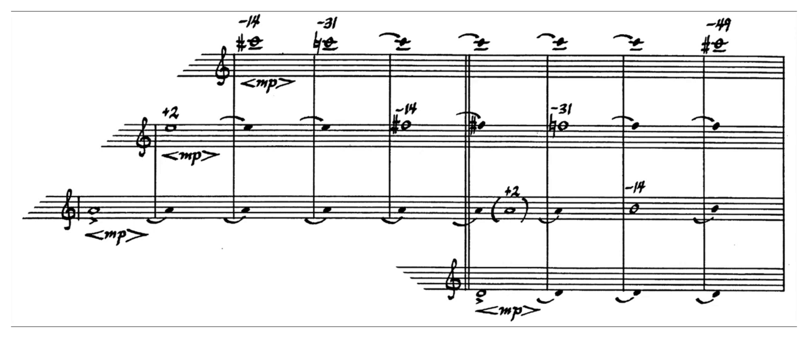
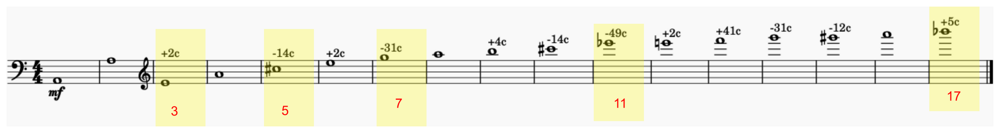
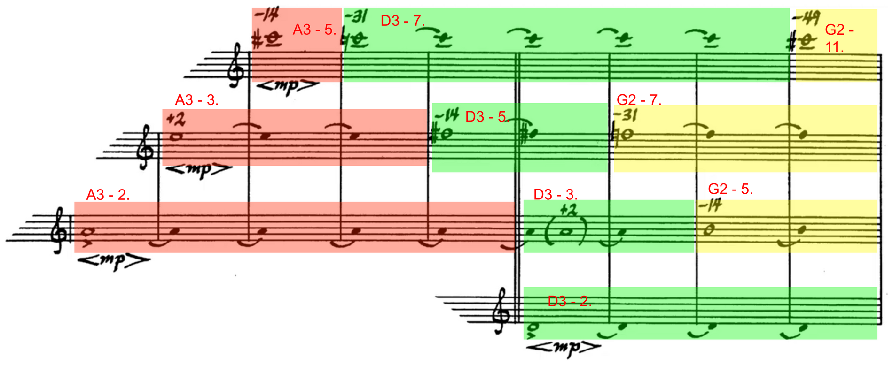
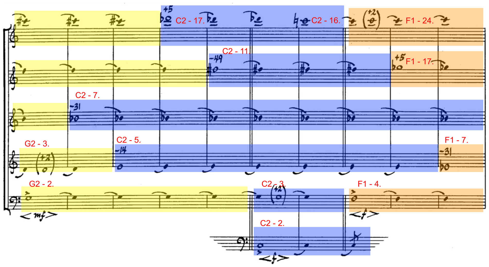
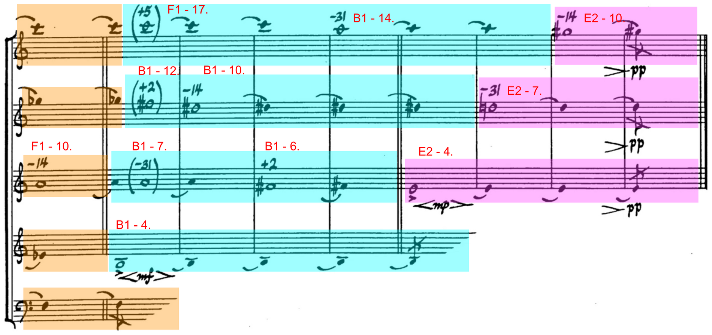

**Opusmodus Tutorial** \
Studio for Electronic Music (SEM) \
Universität Mozarteum Salzburg \
(c) Achim Bornhoeft

---

# Tenney – Harmonium #1

James Tenney's **Harmonium #1** (9/76, dedicated to Lou Harrison) is a piece
of spectral music for an ensemble of twelve or more sustaining instruments.
All of the pitch material arises from the **harmonic series** over changing
fundamentals. This tutorial reconstructs one concrete *reading* of the score
in Opusmodus: frequencies are calculated from the fundamentals and their
partials, converted into notation, and assembled into six voices.


## The Recording

{center, width=720}

▶ [Play recording (MP4, approx. 10:35)](media/Tenney-Harmonium-1-1976.mp4)

The score runs along in the video. Clearly visible are the `<mp>` hairpins
and the handwritten cent figures (`-14`, `-31`, `+2`, `-49`) above the notes –
exactly the values that are entered programmatically again below.


## About the Piece

The score consists of **seven sections** (double bar lines), each divided
into two to five **segments** (single bar lines). Each segment notates the
*pitches currently available*; the numbers above the notes indicate the
deviation from the tempered pitch in **cents**.

The performance instruction (paraphrased): each player chooses one of the
available pitches in turn and plays it as a hairpin `ppp < X > ppp`, where
`X` is the notated dynamic. Each tone lasts four to twelve seconds, divided
evenly between crescendo and decrescendo; after a rest, the next tone
follows – either the same pitch or a different available one. The transition
into a new segment can be initiated by any voice by introducing the newly
available pitch. The transitions are timed so that each section lasts
roughly one to three minutes.

The realization below fixes these aleatoric freedoms into one of many
possible versions: fixed entries, fixed durations, six voices, tempo 20.\
At tempo 20, a whole note lasts ≈ 12 seconds – exactly the upper end of
Tenney's range of "four to twelve seconds."


## The Harmonic Series as Material

{center, width=720}

The overtones do not fall on the tempered grid. Their deviation from the
nearest tempered pitch is constant for each partial – independent of the
fundamental:

| Partial | Interval above the fundamental | Deviation |
| --- | --- | --- |
| 2 | Octave | 0 |
| 3 | Fifth | +2c |
| 5 | Major third | −14c |
| 7 | Minor seventh | −31c |
| 11 | Tritone | −49c |
| 13 | (Sixth) | +41c |
| 16 | Octave | 0 |
| 17 | Minor second | +5c |

Octave-related partials inherit the deviation of their odd-numbered core: 4
and 16 behave like 1; 6, 12, and 24 behave like 3 (+2c); 10 behaves like 5
(−14c); 14 behaves like 7 (−31c).

Tenney's structural material consists primarily of the **prime-numbered partials** 3, 5, 7, 11, and 17 (shown in yellow in the graphic). We first calculate the series "by hand" – fundamental frequency times partial number:

```lisp
;; Frequency of c2 and its first eight partials (in hertz)
(loop with fundamental = (pitch-to-hertz 'c2)
      for partial from 1 to 8
      collect (* fundamental partial))
```


## 1 – The Fundamentals

The fundamentals move through descending fifths (a3 → d3 → g2 → c2 → f1) and
then rise again via an augmented fourth leap (f1 → b1) and a perfect fourth
(b1 → e2):

```lisp
(setf fundamentals '(a3 d3 g2 c2 f1 b1 e2))
```


## 2 – Partials per Fundamental

For each fundamental it is specified which partials sound over the course of
the piece. The selection grows from three pitches over a3 to seven pitches
over c2, and extends over f1 up to the 24th partial:

```lisp
(setf overtones
      '((2 3 5)                       ; Partials of a3
        (2 3 5 7)                     ; Partials of d3
        (2 3 5 7 11)                  ; Partials of g2
        (2 3 5 7 11 16 17)            ; Partials of c2
        (4 7 10 17 24)                ; Partials of f1
        (4 6 7 10 12 14 17)           ; Partials of b1
        (4 7 10)))                    ; Partials of e2
```

The color-marked areas in the score correspond exactly to these
fundamental/partial groups. The red, green, and yellow fields show the first
three fundamentals (a3, d3, g2):

{center, width=720}

Blue and orange follow with c2 and f1:

{center, width=720}

The conclusion is formed by b1 (cyan) and e2 (magenta):

{center, width=720}


## 3 – Calculating Frequencies

Each fundamental is converted to hertz and multiplied by its partial
numbers. The result is a list of frequency lists – one per fundamental:

```lisp
(setf pitches-hz
      (loop for i in (pitch-to-hertz fundamentals)
            for j in overtones
            collect
              (loop for k in j
                    collect (* k i))))
```

The partials over c2 (index 3) as a frequency curve:

```plot1
(nth 3 pitches-hz)
```


## 4 – From Hertz to Notation

`hertz-to-pitch` quantizes the frequencies to the nearest pitch grid. With
`:quantize 1/2`, note heads are rounded to quarter tones (easy to read); for
a more accurate rendering, quantization to `1/8` can be used:

```lisp
(setf pitches (hertz-to-pitch pitches-hz :quantize 1/2))
```

So that the long swelling tones sound unbroken, every note receives a `tie`
attribute – a list of ties structured like the pitches:

```lisp
(setf ties
      (loop for i in pitches
              collect (loop repeat (length i)
                              collect 'tie)))
```

From pitches, whole notes, and ties, the OMN material is created. With
`single-events`, every note becomes an individually addressable event – so
that later a specific partial of a specific fundamental can be picked out
deliberately:

```lisp
(setf mat
      (single-events
       (make-omn
        :pitch pitches
        :length '(w)
        :attribute ties
        :span :pitch)))
```

`mat` is a list of seven voices (one per fundamental). Access happens in two
steps: `(nth fundamental-index (nth … ))` – for example, `(nth 2 (nth 0
mat))` returns the event at position 2 over fundamental 0 (a3), i.e. the
**5th partial**.

The complete material – all seven harmonic series stacked together – as
multi-voice notation:

```omn2
mat
```

Finally, an empty 4/4 bar as a rest module for the voice entries:

```lisp
(setf pause (make-omn :length '(-w)))
```


## 5 – The Six Voices

Each voice is built in two steps:

1. Using `append` and `gen-loop`, the building blocks from `mat` (and
   `pause`) are strung together to the desired number of bars – this is the
   temporal sequence.
2. `dictum` then applies expression and finer details to exactly defined
   bars: the hairpin dynamics (`<mp>`, `<mf>`, `<f>` as the target "X"), the
   articulation `marc`, removal of MIDI velocity (so that the hairpins
   control the volume), and the removal of individual ties. Above all,
   `dictum` enters the **cent values** (`2c`, `-14c`, `-31c`, `-49c`, `5c`)
   at exactly the bars where a new partial enters – analogous to the
   handwritten cent figures in Tenney's score.

### First Voice

```lisp
(setf voc1
      (dictum '((:remove :velocity)
                (:do <mp> :bar 3)
                (:do -14c :bar 3)
                (:do -31c :bar 4)
                (:do -49c :bar 9)
                (:remove tie :bar 12)
                (:do 5c :bar 13)
                (:do 2c :bar 17)
                (:do 5c :bar 21)
                (:do -31c :bar 24)
                (:do -14c :bar 27))
              (append
               (gen-loop 2 pause)
               (gen-loop 1 (nth 2 (nth 0 mat)))
               (gen-loop 5 (nth 3 (nth 1 mat)))
               (gen-loop 4 (nth 4 (nth 2 mat)))
               (gen-loop 3 (nth 6 (nth 3 mat)))
               (gen-loop 1 (nth 5 (nth 3 mat)))
               (gen-loop 4 (nth 4 (nth 4 mat)))
               (gen-loop 3 (nth 6 (nth 5 mat)))
               (gen-loop 3 (nth 5 (nth 5 mat)))
               (gen-loop 1 (nth 2 (nth 6 mat))))))
```

The course of this voice matches, bar for bar, the top line of the score:

| Bars | Fundamental | Partial | Label / Note |
| --- | --- | --- | --- |
| 1–2 | – | – | Rest |
| 3 | a3 | 5 (−14c) | A3-5, entry `<mp>` |
| 4–8 | d3 | 7 (−31c) | D3-7 |
| 9–12 | g2 | 11 (−49c) | G2-11; tie released from bar 12 |
| 13–15 | c2 | 17 (+5c) | C2-17 |
| 16 | c2 | 16 | C2-16 |
| 17–20 | f1 | 24 (+2c) | F1-24 |
| 21–23 | b1 | 17 (+5c) | B1-17 |
| 24–26 | b1 | 14 (−31c) | B1-14 |
| 27 | e2 | 10 (−14c) | E2-10 |

The finished voice as notation:

```omn
voc1
```

…and as a pitch contour (clearly visible: the descending-then-ascending
fundamental motion):

```plot4
voc1
```

### Second through Sixth Voice

The remaining voices follow the same principle with their own entries,
durations, and cent markings. Together they produce the layering of the
colored fields in the score.

```lisp
(setf voc2
      (dictum '((:remove :velocity)
                (:do <mp> :bar 2)
                (:do 2c :bar 2)
                (:do -14c :bar 5)
                (:do -31c :bar 7)
                (:do -49c :bar 14)
                (:remove tie :bar 17)
                (:do 5c :bar 18)
                (:do 2c :bar 21)
                (:do -14c :bar 22)
                (:do -31c :bar 26))
              (append
               (gen-loop 1 pause)
               (gen-loop 3 (nth 1 (nth 0 mat)))
               (gen-loop 2 (nth 2 (nth 1 mat)))
               (gen-loop 7 (nth 3 (nth 2 mat)))
               (gen-loop 4 (nth 4 (nth 3 mat)))
               (gen-loop 3 (nth 3 (nth 4 mat)))
               (gen-loop 1 (nth 4 (nth 5 mat)))
               (gen-loop 4 (nth 3 (nth 5 mat)))
               (gen-loop 2 (nth 1 (nth 6 mat))))))
```

```lisp
(setf voc3
      (dictum '((:remove :velocity)
                (:do <mp> :bar 1)
                (:do marc :bar 1)
                (:do 2c :bar 6)
                (:do -14c :bar 8)
                (:do -31c :bar 11)
                (:do -14c :bar 20)
                (:do -31c :bar 21)
                (:do 2c :bar 23)
                (:do <mp> :bar 25) ; redundant
                (:do marc :bar 25))
              (append
               (gen-loop 5 (nth 0 (nth 0 mat)))
               (gen-loop 2 (nth 1 (nth 1 mat)))
               (gen-loop 3 (nth 2 (nth 2 mat)))
               (gen-loop 9 (nth 3 (nth 3 mat)))
               (gen-loop 1 (nth 2 (nth 4 mat)))
               (gen-loop 2 (nth 2 (nth 5 mat)))
               (gen-loop 2 (nth 1 (nth 5 mat)))
               (gen-loop 3 (nth 0 (nth 6 mat))))))
```

```lisp
(setf voc4
      (dictum '((:remove :velocity)
                (:do <mp> :bar 6)
                (:do marc :bar 6)
                (:do 2c :bar 10)
                (:do -14c :bar 12)
                (:do -31c :bar 19)
                (:do <mf> :bar 21)
                (:do marc :bar 21))
              (append
               (gen-loop 5 pause)
               (gen-loop 4 (nth 0 (nth 1 mat)))
               (gen-loop 2 (nth 1 (nth 2 mat)))
               (gen-loop 7 (nth 2 (nth 3 mat)))
               (gen-loop 2 (nth 1 (nth 4 mat)))
               (gen-loop 4 (nth 0 (nth 5 mat)))
               (gen-loop 3 pause))))
```

```lisp
(setf voc5
      (dictum '((:remove :velocity)
                (:do <mf> :bar 10)
                (:do marc :bar 10)
                (:do <f> :bar 17)
                (:do marc :bar 17)
                (:do 2c :bar 15))
              (append
               (gen-loop 9 pause)
               (gen-loop 5 (nth 0 (nth 2 mat)))
               (gen-loop 2 (nth 1 (nth 3 mat)))
               (gen-loop 4 (nth 0 (nth 4 mat)))
               (gen-loop 7 pause))))
```

```lisp
(setf voc6
      (dictum '((:remove :velocity)
                (:do <f> :bar 15)
                (:do marc :bar 15))
              (append
               (gen-loop 14 pause)
               (gen-loop 2 (nth 0 (nth 3 mat)))
               (gen-loop 11 pause))))
```

Two low voices compared (voc5 and voc6) as multi-voice notation:

```omn2
(list voc5 voc6)
```


## 6 – The Score

`def-score` combines the six voices into a score with flexible clefs and
chromatic key signature. The `controllers (91 …)` entries set reverb; pan
and program assignments distribute the voices across the sound image:

```lisp
(def-score harmonium
    (:title "Harmonium #1"
     :composer "James Tenney"
     :copyright "Copyright © 1976"
     :key-signature 'chromatic
     :time-signature '(4 4)
     :flexible-clef t
     :tempo 20
     :layout (bracket-group
              (flute-layout 'flute)
              (violin-layout 'violin)
              (clarinet-layout 'clarinet)
              (viola-layout 'viola)
              (bassoon-layout 'bassoon)
              (violoncello-layout 'violoncello)))

  (flute
   :omn voc1
   :channel 1
   :sound 'gm
   :program 'violin
   :volume 100
   :pan 44
   :controllers (91 '(48)))

  (violin
   :omn voc2
   :channel 2
   :sound 'gm
   :program 'violin
   :volume 100
   :pan 54
   :controllers (91 '(48)))

  (clarinet
   :omn voc3
   :channel 3
   :sound 'gm
   :program 'viola
   :volume 90
   :pan 74
   :controllers (91 '(60)))

  (viola
   :omn voc4
   :channel 4
   :sound 'gm
   :program 'viola
   :volume 90
   :pan 74
   :controllers (91 '(60)))

  (bassoon
   :omn voc5
   :channel 5
   :sound 'gm
   :program 'cello
   :volume 90
   :pan 84
   :controllers (91 '(60)))

  (violoncello
   :omn voc6
   :channel 6
   :sound 'gm
   :program 'cello
   :volume 90
   :pan 84
   :controllers (91 '(60))))
```

Display score:

```lisp
(display-musicxml 'harmonium)
```


## Practical Notes

- The code blocks build on each other. The most convenient way is to
  evaluate them from top to bottom – **Tools > Markdown Developer >
  Evaluate Markdown Code Blocks** (Cmd-Opt-Shift-E) – or block by block via
  **Evaluate**.
- `:quantize 1/2` prioritizes readable note heads; for a more accurate
  rendering, switch to `(setf pitches (hertz-to-pitch pitches-hz :quantize
  1/8))`.
- The `dictum` lists are the natural place for variants: different entries,
  durations, or dynamics produce a new reading of the same piece.
- Tempo 20 ⇒ whole note ≈ 12 s. Anyone wanting shorter hairpins should
  increase the tempo or subdivide the whole notes.

Source of the code: `tenney-harmonium-_1.opmo`.
